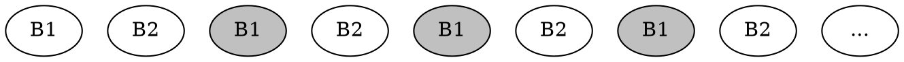

---
slideOptions:
  theme: white
---

<style>
.reveal {
  font-size: 24px;
}
.reveal section img {
    background:none;
    border:none;
    box-shadow:none;
}
pre.graphviz {
    box-shadow: none;
}
</style>

## Memory-Bound Algorithms

High Performance Computing, Lecture 1

Sergey Slotin
Dec 11, 2020

---

## What this course is about

* You won't learn a asymptotically better algorithms, but you will become good at squeezing performance from hardware
* This is an introduction: we aim to cover 20% of supercomputing curriculum that solves 80% of real-world problems
* This course is practical: formality is replaced with code
* Prerequisites: CS 101, C++, Python

---

## Schedule

<style>
table {
  font-size: 20px;
}
</style>

| \#  | Date*  | Title                         | Subtopics                                              |
|:--- | ------ | ----------------------------- |:------------------------------------------------------ |
| 1   | Dec 11 | Memory-Bound Algorithms       | cache hierarchy, cache-aware algorithms                |
| 2   | Dec 18 | Instruction-Level Parallelism | pipelining, branch prediction, bandwidth-latency       |
| 3   | Dec 25 | Data Parallelism              | SIMD, SSE, AVX                                         |
| 4   | Jan 8  | Concurrency                   | threads, processes, greenlets, syncronization, mutexes |
| 5   | Jan 15 | Parallelism                   | thread pools, OpenMP, non-blocking algorithms          |
| 6   | Jan 22 | GPU Programming               | GPGPU, CUDA, kernels, barriers, scan, gather           |
| 7   | Jan 29 | Massively Parallel Algorithms | sorting, graph algorithms, hash table                  |
| 8   | Feb 5  | MapReduce                     | Hadoop, Dask, partition, shuffle                       |
| 9   | Feb 12 | Cloud Computing               | job scheduling, data partitioning, preemptibility      |

\*Changes are very likely

----

## Possible Bonus Lectures

* Message Passing: MPI, actors
* Data-Intensive Applications: must-know for backend developers
* High Performance Python: JIT, Cython, Numba, Jax
* Green Threads: how language runtimes work
* Computational Linear Algebra: matmul, convolution, FFT, SVD
* Cryptography: RSA, password cracking, blockchain
* Quantum Computing: how humanity will factorize numbers in 50 years
* *Come and present your own!*

---

### Links

* Exercises on [GitHub](https://github.com/sslotin/tinkoff-hpc)
* Lectures on [YouTube](https://www.youtube.com/watch?v=f-AQ3lWWOZY&list=PLuC78Z-ctguXZDvlWIC46QGZG2TnxSUBt)
* Discussions on [Telegram](https://t.me/joinchat/FI6QYkfYU50ncTGzrvUL4Q)

---

## Lecture 1: Memory-Bound Algorithms

OK let's start then

---

## The RAM Model of Computation

* Abstract "operations" that all take constant time
* Everything is done sequentially, including i/o
* We only care about asymptotic complexity: $O(n) = O(1000 \cdot n)$
* $\implies$ "Costs" of basic ops don't matter since they don't affect complexity

----

## Reality


http://ithare.com/infographics-operation-costs-in-cpu-clock-cycles/

----

<!-- .slide: id="latencies" -->
<style>
#latencies {
  font-size: 24px;
}
</style>

```
Latency Comparison Numbers (~2012)
----------------------------------
L1 cache reference                           0.5 ns
Branch mispredict                            5   ns
L2 cache reference                           7   ns                      14x L1 cache
Mutex lock/unlock                           25   ns
Main memory reference                      100   ns                      20x L2 cache, 200x L1 cache
Compress 1K bytes with Zippy             3,000   ns        3 us
Send 1K bytes over 1 Gbps network       10,000   ns       10 us
Read 4K randomly from SSD*             150,000   ns      150 us          ~1GB/sec SSD
Read 1 MB sequentially from memory     250,000   ns      250 us
Round trip within same datacenter      500,000   ns      500 us
Read 1 MB sequentially from SSD*     1,000,000   ns    1,000 us    1 ms  ~1GB/sec SSD, 4X memory
Disk seek                           10,000,000   ns   10,000 us   10 ms  20x datacenter roundtrip
Read 1 MB sequentially from disk    20,000,000   ns   20,000 us   20 ms  80x memory, 20X SSD
Send packet CA->Netherlands->CA    150,000,000   ns  150,000 us  150 ms

Notes
-----
1 ns = 10^-9 seconds
1 us = 10^-6 seconds = 1,000 ns
1 ms = 10^-3 seconds = 1,000 us = 1,000,000 ns
```

https://gist.github.com/jboner/2841832

----


https://twitter.com/holly_cummins/status/530372145025908737

---

## Memory Hierarchy


----

## Real Numbers

| Type | $M$      | $B$ | Latency | $/GB/mo* |
|:---- |:-------- | --- | ------- |:-------- |
| L1   | 10K      | 64B | 0.5ns   | -        |
| L2   | 100K     | 64B | 5ns     | -        |
| L3   | 1M       | 64B | 20ns    | -        |
| RAM  | GBs      | 64B | 100ns   | 1.5      |
| SSD  | TBs      | 4K  | 0.1ms   | 0.17     |
| HDD  | TBs      | -   | 10ms**  | 0.04     |
| S3   | $\infty$ | -   | 150ms   | 0.02***  |


<div style='text-align:left; font-size: 16px; width:500px; margin: auto; margin-top: 20px;'>
*Google Cloud pricing
<br>
**HDD is a spinning physical thing so random access is complicated
<br>
***Archive tiers can go as low as $1.2/TB with huge retrieval charges
</div>

----



HDD random access latency is complicated

---

##  External Memory Model

* Consider one level in cache hierarchy
* Data size is $N$, which we can read and write in blocks of $B$
* We have $M$ memory, meaning that we can store $\left \lfloor \frac{M}{B} \right \rfloor$ blocks
* We only care about i/o: any computation done in-between reads and writes is free
* We assume $N >> M >> B$ (tall cache assumption: $M \geq B^{1+ε}$ for $\epsilon > 0$)

[Aggarwal & Vitter '88]

---

## Array Scan

For example, when we calculate $\sum_i a_i$, it takes $SCAN(N) \stackrel{\text{def}}{=} O(\left \lceil \frac{N}{B} \right \rceil)$ IOPS

$$
\underbrace{a_1, a_2, a_3}_{B_1}
\underbrace{a_4, a_5, a_6}_{B_2}
\ldots
\underbrace{a_{n-3}, a_{n-2}, a_{n-1}}_{B_{m-1}}
$$

RAM caching is transparent, but you need to use bufferization when working with external memory (e. g. HDD) unless it is [memmap](https://en.wikipedia.org/wiki/Mmap)-ed

----

### Prefetching*

What you write:

```cpp
for (int i = 0; i < n; i++) {
    do_stuff(a[i]);
}
```

What compiler does:

```cpp
for (int i = 0; i < n; i++) {
    if (int(&a[i]) % BLOCK_SIZE == 0)
        __builtin_prefetch(&a[i] + BLOCK_SIZE);;
    do_stuff(a[i]);
}
```

You can request more than one block at a time, but we forget about it for now

More on that in the next lecture

---

## Merge

* You can merge two sorted arrays with two pointers
* Reads and writes can be bufferized, so it works in $SCAN(N+M)$ operations
* Multi-way merges work the same as long as we can fit $O(\frac{M}{B})$ blocks in memory (remember $M >> B$ assumption)
* <!-- .element: class="fragment" data-fragment-index="1" --> Know a fun thing we can do with merging?

---

## Merge Sorting


* We can sort elements inside $N \over B$ blocks "for free"
* "Normal" complexity: $O(N \log_2 N)$
* IO complexity? <span> <!-- .element: class="fragment" data-fragment-index="2" --> $O(\frac{N}{B} \log_2 \frac{N}{B})$ </span>
* <!-- .element: class="fragment" data-fragment-index="4" --> Can we do better?

----

## k-way merging


Let's merge $k = \frac{M}{B}$ arrays instead of 2 because we can

Complexity? <span> <!-- .element: class="fragment" data-fragment-index="2" --> $O(\frac{N}{B} \log_{\frac{M}{B}} \frac{N}{B})$ </span>

<span> <!-- .element: class="fragment" data-fragment-index="3" --> (of course, it all only makes sense on HDD or larger) </span>

---

## Join

Real-world application:

* Input: two lists of tuples: $(x_i, a_{x_i})$ and $(y_i, b_{y_i})$
* Output: list $(k, a_{x_k}, b_{y_k})$ such that $x_k = y_k$
* Solution: two sorts and three pointers
* Complexity: same as sorting

This is why data processing applications like to keep their tables sorted

----

## Hash Join

If you have the memory that's how you do it in linear time:

```python
def join(a, b):
    d = dict(a)
    for x, y in b:
        if x in d:
            yield d[x]
```

----

## Non-Comparison Sorting

Radix sort: apply *stable* count sorting for each "radix"

```cpp
const int c = (1<<16);

void radix_sort(vector<int> &a) {
    vector<int> b[c];
    
    for (int x : a)
        b[x % c].push_back(x);
    
    for (int i = 0, k = 0; i < c; i++) {
        for (int x : b[i])
            a[k++] = x;
        b[i].clear();
    }
    
    for (int x : a)
        b[x / c].push_back(x);
    
    for (int i = 0, k = 0; i < c; i++)
        for (int x: b[i])
            a[k++] = x
}
```

$O(\frac{N}{B} \cdot w)$ if we have the memory

Could be beneficial in the case of small keys and large datasets

---

## Caching strategies

*Eviction policy* is how we determine which blocks to keep in memory if we run out of it

* $FIFO$: first in, first out
* $LRU$: least recently used
* $OPT$: "optimal" one that greedily removes the latest-to-be-used block
  (you need to able to predict the future to do that)

Hardware-defined for CPU caches, programmable for everything larger

----


Direct-mapped cache

----


Fully associative cache

----


Set-associative
(most CPU caches are either direct-mapped or 2- or 4-associative)

---

$LRU_M \leq 2 \cdot OPT_{M/2}$

[Sleator & Tarjan '85]

<span><!-- .element: class="fragment" data-fragment-index="3" -->It doesnt affect complexity in most of the cases
So it doesn't really matter that much which eviction policy to use</span>

----

### Sketch of a proof

$LRU_M \leq 2 \cdot OPT_{M/2}$

* Consider "worst case" scenario: repeating series of $\frac{M}{B}$ distinct blocks
* For $LRU$, each block is new and so it has 100% cache misses
* $OPT_{M/2}$ would be able to cache half of them and thus halve the time
* Anything better for $LRU$ would only strengthen this inequality



---

## Data Locality

* Temporal locality: it is likely that this same location will soon be requested again
* Spacial locality: it is likely that a nearby location will be requested right after

Abstracting away from how cache works helps a lot when designing algorithms

---

### Depth-First vs Breadth-First

* A lot of algorithms can be implemented in one of two ways
* Recursive: you would be able to fit smaller datasets into cache (temporal locality)
* Iterative: you would be able to do sequential i/o (spacial locality)

For example, you want to do divide-and-conquer depth-first most of the time

----

Consider the knapsack problem (in Python for simplicity):

```python
@lru_cache
def f(i, k):
    if i == n or k == 0:
        return 0
    if w[i] > k:
        return f(i + 1, k)
    return max(f(i + 1, k), c[i] + f(i + 1, k - w[i]))
```

The recursion is extremely slow not because its recursion,
but because it does random i/o throughout most of the execution

```cpp
int f[N+1][W+1];

for (int i = n - 1; i >= 0; i++)
    for (int k = 0; k <= W; k++)
        f[i][k] = (w[i] > k ? f[i+1][k] : max(f[i+1][k], c[i] + f[i+1][k-w[i]]));
```
<!-- .element: class="fragment" data-fragment-index="1" -->

Note that each layer is computed and then accessed exactly once right after
(you actually need $O(W)$ memory which could all fit into L1 cache)
<!-- .element: class="fragment" data-fragment-index="2" -->

---

### Array-of-Structs and Struct-of-Arrays

Suppose you build a binary tree and store it like this (SoA):

```
int left_child[maxn], right_child[maxn], key[maxn], size[maxn];
```

It it was stored like this (AoS), you would need ~4 times less block reads:

```
struct Data {
    int left_child, right_child, key, size;
};

Data data[maxn];
```

AoS is better for seaching, SoA is better for scanning

----

### Iteration Order Matters

* Sparse table is a *static* data structure for computing *idempotent reductions*
  (on subsegments of arrays, e. g. static RMQ)
* To build it, you need to compute the function for all power-of-two length segments
* You can do it in DP fashion by using already processed segments

```cpp
int mn[logn][maxn];

for (int l = 0; l < logn - 1; l++)
    for (int i = 0; i + (2 << l) <= n; i++)
        mn[l+1][i] = min(mn[l][i], mn[l][i + (1 << l)]);
```

There are a total of 2×2=4 ways to build it,
only one of them yields beautiful linear passes that work ~3x faster

---

## Cache-Efficient Algorithms

* Cache-aware: efficient with *known* $B$ and $M$
* Cache-oblivious: efficient for *any* $B$ and $M$

E. g. external merge sort is cache-aware, but not cache-oblivious

Cache-oblivious algorithms are cool because they are optimal for all memory levels

---

## Transposing matrices

Assume we have a square matrix $A$ of size $N \times N$.

Naive way to transpose it:

```cpp
for (int i = 0; i < n; i++)
    for (int j = 0; j < i; j++)
        swap(a[j][i], a[i][j])
```

I/O complexity is $O(N^2)$: writes are not sequential

(if you swap iteration variables it's going to be the same but for writes)

----

### Cache-oblivious algorithm

1. Divide the input matrix into 4 smaller matrices
2. Transpose each one recursively
3. Combine results by swapping corner result matrices
4. Stop until it fits into cache

$$\begin{pmatrix}
A & B \\
C & D
\end{pmatrix}^T=
\begin{pmatrix}
A^T & C^T \\
B^T & D^T
\end{pmatrix}
$$

Complexity: $O(\frac{N^2}{B})$. Pick something like 32x32 if you don't know cache size beforehand

----

Implementing D&C on matrices is a bit more complex than on arrays,
but the idea is the same: we want to use "virtual" matrices instead of copying them

```cpp
template<typename T>
struct Matrix {
    int x, y, n, N;
    T* data;
    T* operator[](int i) { return data + (x + i) * N + y; }
    Matrix<T> subset(int _x, int _y, int _n) { return {_n, _x, _y, N, data}; }

    Matrix<T> transpose() {
        if (n <= 32) {
            for (int i = 0; i < n; i++)
                for (int j = 0; j < i; j++)
                    swap((*this)[j][i], (*this)[i][j]);
        } else {
            auto A = subset(x, y, n / 2).transpose();
            auto B = subset(x + n / 2, y, n / 2).transpose();
            auto C = subset(x, y + n / 2, n / 2).transpose();
            auto D = subset(x + n / 2, y + n / 2, n / 2).transpose();
            for (int i = 0; i < n; i++)
                for (int j = 0; j < n; j++)
                    swap(B[i][j], C[i][j]);
        }

        return *this;
    }
};
```

Rectangular and non-power-of-two matrices is a homework 

---

## Matrix multiplication

$C_{ij} = \sum_k A_{ik} B_{kj}$

```cpp
// don't forget to initialize c[][] with zeroes
for (int i = 0; i < n; i++)
    for (int j = 0; j < n; j++)
        for (int k = 0; k < n; k++)
            c[i][j] += a[i][k] * b[k][j];
```

* Naive? <span>$O(N^3)$: each scalar multiplication needs a new block read <!-- .element: class="fragment" data-fragment-index="1" --></span>

* What if we transpose $B$ first? <span><!-- .element: class="fragment" data-fragment-index="2" --> $O(N^3/B + N^2)$</span>

```cpp
for (int i = 0; i < n; i++)
    for (int j = 0; j < i; j++)
        swap(b[j][i], b[i][j])
// ^ or use our faster transpose from before

for (int i = 0; i < n; i++)
    for (int j = 0; j < n; j++)
        for (int k = 0; k < n; k++)
            c[i][j] += a[i][k] * b[j][k]; // <- note the indices
```
<!-- .element: class="fragment" data-fragment-index="2" -->


<span><!-- .element: class="fragment" data-fragment-index="3" --> Can we do better?</span>

----

### Divide-and-Conquer

Essentially the same trick: divide data until it fits into lowest cache ($N^2 \leq M$)

$$\begin{pmatrix}
A_{11} & A_{12} \\
A_{21} & A_{22} \\
\end{pmatrix} \begin{pmatrix}
B_{11} & B_{12} \\
B_{21} & B_{22} \\
\end{pmatrix} = \begin{pmatrix}
A_{11} B_{11} + A_{12} B_{21} & A_{11} B_{12} + A_{12} B_{22}\\
A_{21} B_{11} + A_{22} B_{21} & A_{21} B_{12} + A_{22} B_{22}\\
\end{pmatrix}
$$

Arithmetic complexity is the same,
becase $T(N) = 8 \cdot T(N/2) + O(N^2)$ is solved by $T(N) = O(N^3)$

It doesn't seem like we "conquered" anything yet, but let's think about I/O complexity

$$T(N) = \begin{cases}
O(\frac{N^2}{B}) & N \leq \sqrt M & \text{(we only need to read it)} \\
8 \cdot T(N/2) + O(\frac{N^2}{B}) & \text{otherwise}
\end{cases}$$
<!-- .element: class="fragment" data-fragment-index="2" -->

Dominated by $O((\frac{N}{\sqrt M})^3)$ base cases, so total complexity is $T(N) = O\left(\frac{(\sqrt{M})^2}{B} \cdot (\frac{N}{\sqrt M})^3\right) = O(\frac{N^3}{B\sqrt{M}})$
<!-- .element: class="fragment" data-fragment-index="3" -->

----

## Strassen Algorithm*

<!-- .slide: id="strassen" -->
<style>
#strassen {
    font-size: 18px;
}
</style>

$$\begin{pmatrix}
C_{11} & C_{12} \\
C_{21} & C_{22} \\
\end{pmatrix}
=\begin{pmatrix}
A_{11} & A_{12} \\
A_{21} & A_{22} \\
\end{pmatrix}
\begin{pmatrix}
B_{11} & B_{12} \\
B_{21} & B_{22} \\
\end{pmatrix}
$$

Compute intermediate products of $\frac{N}{2} \times \frac{N}{2}$ matrices and combine them to get matrix $C$:

$$
\begin{align}
   M_1 &= (A_{11} + A_{22})(B_{11} + B_{22})   & C_{11} &= M_1 + M_4 - M_5 + M_7
\\ M_2 &= (A_{21} + A_{22}) B_{11}             & C_{12} &= M_3 + M_5
\\ M_3 &= A_{11} (B_{21} - B_{22})             & C_{21} &= M_2 + M_4
\\ M_4 &= A_{22} (B_{21} - B_{11})             & C_{22} &= M_1 - M_2 + M_3 + M_6
\\ M_5 &= (A_{11} + A_{12}) B_{22}
\\ M_6 &= (A_{21} - A_{11}) (B_{11} + B_{12})
\\ M_7 &= (A_{12} - A_{22}) (B_{21} + B_{22})
\end{align}
$$

We use only 7 multiplications instead of 8, so arithmetic complexity is $O(n^{\log_2 7}) \approx O(n^{2.81})$

----


As of 2020, current world record is $O(n^{2.3728596})$

---

## Hash Tables


----

### Chaining


A lot of linked lists or growable arrays

----

### Open Addressing


Fixed number of cells and a hash function $f_i(x)$ that decides where to look on $i$-th step

----

Implementation with a cyclic array:

```cpp
struct hashmap {
    const int size = (1<<24);
    int a[size] = {-1}, b[size];

    static inline int h(int x) { return (x^179)*7; }

    void add(int x, int y) {
        int k = h(x) % size;
        while (a[k] != -1 && a[k] != x)
            k = (k + 1) % size;
        a[k] = x, b[k] = y; 
    }

    int get(int x) {
        for (int k = h(x) % size; a[k] != -1; k = (k + 1) % size)
            if (a[k] == x)
                return b[k];
        return -1;
    }
};
```

Same asymptotic complexity, but 2-3x difference in real speed

----


The only downside is that you need to rehash it more often

---

## Next week

* Will learn how to leverage concurrent i/o and instruction-level parallelism
* Binary search, B-trees, segment trees and searching in data structures in general
* Teaser: going to speed up `std::lower_bound` 5x
* Exercise problems will to appear soon

If you are interested:

* ["What every programmer should know about memory"](https://people.freebsd.org/~lstewart/articles/cpumemory.pdf) by Ulrich Drepper 
* ["Cache-Oblivious Algorithms and Data Structures"](https://erikdemaine.org/papers/BRICS2002/paper.pdf) by Erik Demaine
* [Mini-course on external memory algorithms](https://www.lektorium.tv/course/22905) by Maxim Babenko (in Russian)
